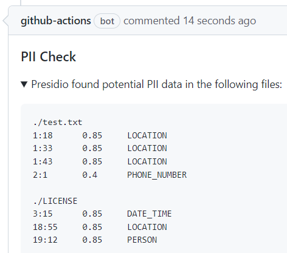

# Presidio Action

Github Action that analyzes text for PII entities with [Microsoft's Presidio framework](https://microsoft.github.io/presidio/).

## Author

Insights Engineering

## Inputs

* `path`:

    _Description_: Path to verify

    _Required_: `false`

    _Default_: "."

* `configuration-file`:

    _Description_: Path to custom configuration file

    _Required_: `false`

    _Default_: "default"

* `configuration-data`:

    _Description_: Configuration data as an inline YAML configuration

    _Required_: `false`

    _Default_: ""

* `output`:

    _Description_: Format of output

    _Required_: `false`

    _Default_: "auto"

* `publish`:

    _Description_: Publish result as a PR comment

    _Required_: `false`

    _Default_: "true"

* `upload`:

    _Description_: Upload results as an artifact

    _Required_: `false`

    _Default_: "true"

* `presidio-cli-version`:

    _Description_: Presidio CLI version

    _Required_: `false`

    _Default_: "latest"

* `lang-models`:

    _Description_: List of additional language models to install

    _Required_: `false`

    _Default_: ""

* `only-changed-files`:

    _Description_: Only run checks for changed files

    _Required_: `false`

    _Default_: `false`

## Outputs

An output depends on the `output` parameter:

The default format is `auto`.

Available formats:

* standard - standard output format

```shell
tests/conftest.py
  34:58     0.85     PERSON
  37:33     0.85     PERSON
```

* github - similar to diff function in github

```shell
::group::tests/conftest.py
::0.85 file=tests/conftest.py,line=34,col=58::34:58 [PERSON]
::0.85 file=tests/conftest.py,line=37,col=33::37:33 [PERSON]
::endgroup::
```

* colored - standard output format but with colors

* parsable - easy to parse automaticaly

```shell
{"entity_type": "PERSON", "start": 57, "end": 62, "score": 0.85, "analysis_explanation": null}
{"entity_type": "PERSON", "start": 32, "end": 37, "score": 0.85, "analysis_explanation": null}
```

* auto - default format, switches automatically between those 2 modes:
  * github, if run on github - environment variables `GITHUB_ACTIONS` and `GITHUB_WORKFLOW` are set
  * colored, otherwise

## How it works

Presidio action uses [presidio-cli](https://pypi.org/project/presidio-cli/)
based on presidio-analyzer from [Microsoft Presidio framework](https://github.com/microsoft/presidio)
to check code against undesirable types of data such as 'EMAIL_ADDRESS' or 'PHONE_NUMBER' inside application's code.

For more information please see a full [list of supported entities](https://microsoft.github.io/presidio/supported_entities/).

## Usage

Example usage:

```yaml
---
name: Presidio check

on:
  push:
    branches:
      - main
  pull_request:
    branches:
      - main

jobs:
  presidio-action:
    runs-on: ubuntu-latest
    name: Presidio check

    steps:
      - name: Checkout Code
        uses: actions/checkout@v2
        with:
          # 0 fetch-depth is needed if you set `only-changed-files` to true
          # and if you are configuring this check to run on push events
          fetch-depth: 0

      - name: Produce the presidio report
        uses: insightsengineering/presidio-action@v1
        # all parameters below are optional
        with:
          # path to project.
          # if project does not have a specific 'my-project' path,
          # '.' - current folder is a default value
          path: "my-project"
          # configuration-file - path to file with specific configuration
          # or use one of predefined files:
          #   - default - `conf/default.yaml` file from action repository, check default list of entities
          #                and ignore content of `.git` folder
          #   - limited - `conf/limited.yaml` file from action repository, check only PERSON, EMAIL_ADDRESS and CREDIT_CARD
          #                and ignore `.git` folder and *.cfg files
          configuration-file: "my-project/conf/my-presidio-config.yaml"
          # configuration-data - content of configuration in raw yaml format.
          # Give possibility to prepare own configuration without adding file to project
          # any value in this field will block usage of configuration file
          configuration-data: |
            entities:
              - PERSON
            threshold: 0.9
          # output - specify one of output formats
          output: "parsable"
          # only-changed-files - only run the check for files that were changed
          # NOTE: You must set fetch-depth: 0 in the actions/checkout@v2 step
          # for push events while this paramater is set to true
          only-changed-files: true

```

Example of comment added to the PR:


